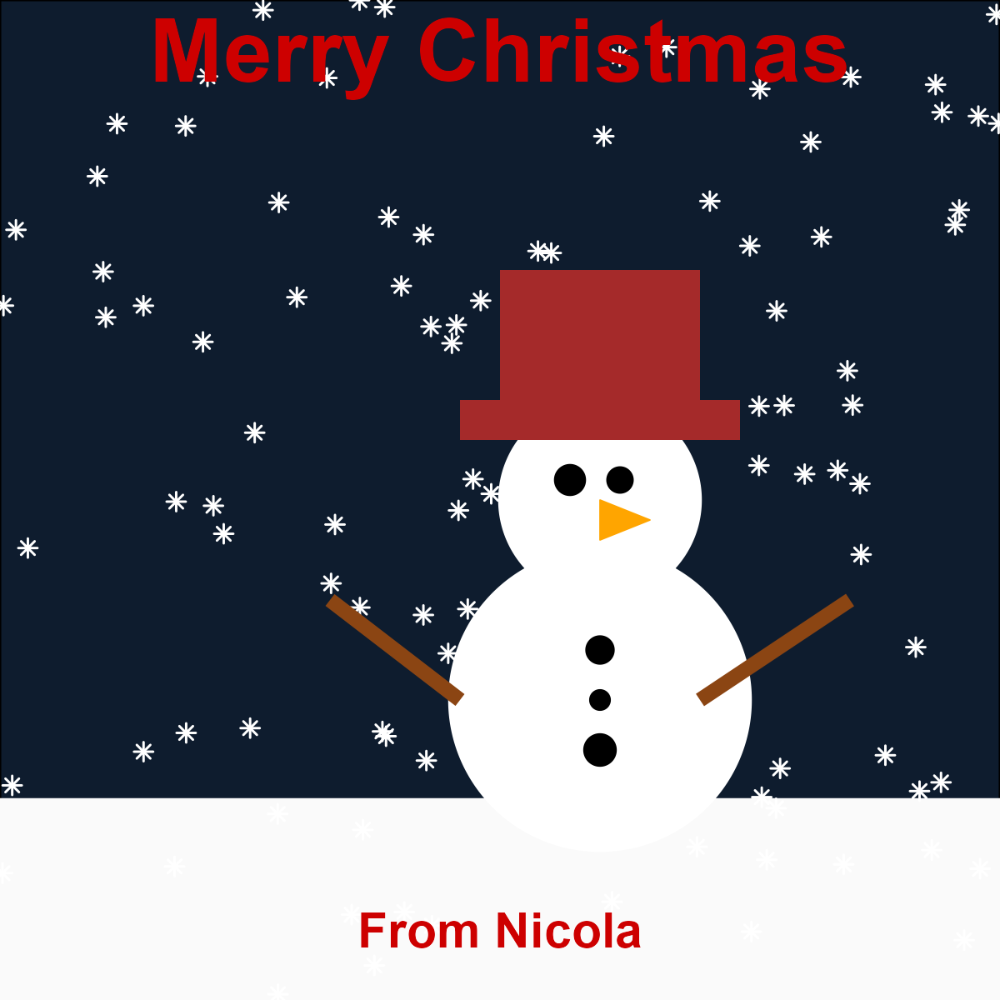

# christmas

Load package into R:

```r
library(christmas)
```

## Secret Santa

Use the `secret_santa()` function to allocate gift recipients by passing in a vector of people's names:

```r
secret_santa(c("John", "Paul", "George", "Ringo"))
```

returns:

```
  gift_giver gift_recipient
1       Paul          Ringo
2     George           John
3       John           Paul
4      Ringo         George
```

## Christmas cards

Create a snowman Christmas card, and save it to a file called `card.png`:

```r
snowman_card("card.png", "From Nicola")
```

which looks like:




